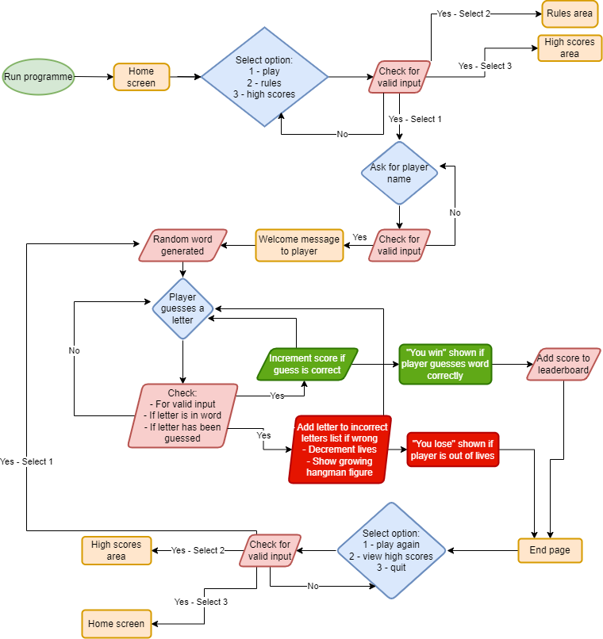

# Hangman
## User Experience
### Site Owner's goals
- To create an entertaining and interactive game of Hangman for user’s to enjoy
- To make it easy for users to interact with the game
- To have a scores system and to enable users to save their high scores
### User's goals
- To easily interact with the game
- To play a fun and entertaining game of Hangman
- To have clear instructions explaining the rules of the game
- To be clearly informed of what any errors are from any invalid inputs
- To view my score after each game
- To save my high scores to a high scores leaderboard
- To have the option to play the game again or quit
## Design
### Flowchart
I made the following flowchart to show the logic of the game from the start to the end, making sure to include any points where validity checks would be needed.

## Features
## Technologies
## Testing
### Validator Testing
### Testing User Stories
### Manual Testing
## Solved Bugs
## Deployment
### Deploying the Project
### Forking the Project
### Cloning the Project
## Credits