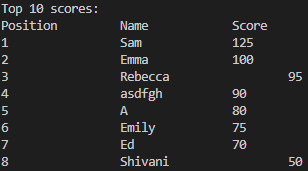

# Countries Hangman
'Countries Hangman' is a terminal based Python game in which players have to guess letters or words to find out the name of a country before they are out of lives and the man is hanged.

View the live site [here](https://hangman-countries.herokuapp.com/)
## User Experience
### Site Owner's goals
- To create an entertaining and interactive game of Hangman for user’s to enjoy
- To make it easy for users to interact with the game
- To have a scores system and to enable users to save their high scores
### User's goals
- To easily interact with the game
- To play a fun and entertaining game of Hangman
- To have clear instructions explaining the rules of the game
- To be clearly informed of what any errors are from any invalid inputs
- To view my score after each game
- To save my high scores to a high scores leaderboard
- To have the option to play the game again or quit
## Design
### Flowchart
I made the following flowchart to show the logic of the game from the start to the end, making sure to include any points where validity checks would be needed.

### Colours
I used colorama to input the following colours:
- Any input error messages from the user are in red as red is a colour often associated with warnings.
- The text is green when the user guesses a letter or word correctly as green is often associated with doing something correctly.
- The text is yellow when the user guesses a letter or word incorrectly or when they are out of lives as I wanted to use a bright colour to stand out, and as I had used red already, I chose yellow as a suitable colour here.
- The initial welcome message is light yellow and bold to make it stand out as the welcoming title of the game.
- The hangman logo is light magenta, again to add a bit of colour to the welcome screen and because this colour is close to red so represents the danger.
## Features
### Welcome page
- This is what the player will be greeted with upon opening the game.
- There are 3 options for the user to choose from:
    - Playing the game
    - Reading the rules
    - Viewing the high scores
- Error messages will appear for any invalid inputs.

Welcome page

### Rules
- This page explains the rules of the game and how scoring will be calculated, along with an explanation of the bonus points.
- The user has to enter 0 to return to the home page.
- Error messages will appear for any invalid inputs.

Rules page

### High scores
- This page displays the top 10 highest scores.
- If there are not 10 scores that have been saved yet, this page will display as many scores as there are in the correct descending order.
- The user has to choose either to play again or return home if they have already played the game (so they would have already inputted a username to allow them to play again).
- Or, if the user views the high scores page after opening the game (and so would not have inputted a username yet), they have to enter 0 to return home, as if they have not played yet, they would be unable to select an option to play again.
- Error messages will appear for any invalid inputs.

High scores page after playing a game

High scores page without playing a game yet

### Play game
- This is where the main Hangman game is played.
- The user is greeted with their inputted name and presented with the empty gallows, 0 points and 6 lives.
- They are shown the blank word as well as what letters they have guessed (which will be updated as they play).
- They are prompted to input a letter or a word of the number of letters in the randomly selected word.

Game page

- The user will receive different messages depending on whether they have guessed the word or letter correctly or not.
- Their score, lives and the hangman figure will also change during the game depending on whether they have guessed correctly or not.

Game page - correctly guessed letter

Game page - correctly guessed word

Game page - incorrectly guessed letter

Game page - incorrectly guessed word

### End of game section
- This is what the user will see once they have finished their game.
- There is a 3 second delay before this page appears so that the user can see the end message before their final score and the end of game options are presented to them.
- There are 3 options for the user to choose from:
    - Playing again
    - Viewing the high scores
    - Returning to the home page
- Error messages will appear for any invalid inputs.

End of game page

### Google Sheet
- This is the Google Sheet that I connected to the game in order to store the high scores

Google Sheet

### Future Features
- I think it would be a nice addition to create different levels of the game, for example based on the different lengths of the words, or different regions of countries, and there could be varying points awarded for the different levels.
## Technologies
- Python
    - Used to build the functionality of the game
        - Python Packages:
            - random: used to generate a random word
            - os: used to clear the screen
            - string: used to create a string of only uppercase letters to be used in the game
            - time: used to create a delay on the screen before showing the next function
            - gspread: used to connect the game to the Google Sheet
            - google.oauth2.service_account: used to enable confidential access to the Google Sheet
            - colorama: used to add colour to the text of the game
- Gitpod
    - Used to develop and edit the code
- Git
    - Used to add, commit and push the code
- Heroku
    - Used to deploy the live site
- [Diagrams.net](https://app.diagrams.net/)
    - Used to create the flowchart that was used to plan the game
## Testing
### Validator Testing
No errors were found when all 3 python pages were passed through the [CI Python Linter](https://pep8ci.herokuapp.com/):

run.py Validator Testing

words.py Validator Testing

hangman_lives.py Validator Testing

### Testing User Stories
- Expectation: To easily interact with the game
    - Result: The menu on the welcome page explains what to do and any invalid inputs are met with error messages explaining the problem or what to do
- Expectation: To play a fun and entertaining game of Hangman
    - The large list of countries available to guess means that if a player plays the game repeatedly it is not likely that the word will be repeated
- To have clear instructions explaining the rules of the game
    - The Rules page, found through the Welcome page, clearly explains how to play the game, how points are awarded or deducted, how lives are lost, and how to gain or lose bonus points
- To be clearly informed of what any errors are from any invalid inputs
    - All error messages will appear in red to make them stand out and they contain information stating what the error is and how to fix it
- To view my score after each game
    - The scores will be calculated and displayed during the game, and once the game is over the player will be shown their final score
- To save my high scores to a high scores leaderboard
    - Scores will automatically be updated to the high scores Google Sheet and the top 10 high scores will be displayed on the High Scores page
- To have the option to play the game again or quit
    - At the end of the game the player has the option to play again, to see the high scores or to return to the Home page
### Manual Testing
## Solved Bugs
- I initally drew the hangman figure incorrectly resulting in it displaying off centre as I realised that you cannot use two ' \ ' as only one ' \ ' displays, leading to the figure being displayed off centre:

 Initial drawing
 Initial figure output
- I decided to draw the final figure without as many ' \ ' because of this issue and because I though the final result looked better.

     Final output

- The Scoresheet was initally not updating correctly but this was solved by adding USER_NAME and score as parameters of the function.
- The screen was not clearing when selecting to play again at the end of the game. This was fixed by moving the clear operation before play_game() instead of after it:

 Code before

 Code after

- The high scores were printing in reverse alphabetical order instead of a decreasing numerical order and the scores were printing as strings instead of integers:

    
    - This was solved by converting the scores to integers and implementing the following code found on Stack Overflow to print the scores in numerically decreasing order:

 Scores after

- There was an error on the scoresheet when there were not at least 10 scores saved on the Google Sheet. This is because the range for the scores had been set to 10:

    - This was solved by adding an if/else statement to create a maximum range if there are less than 10 scores saved:

     
- The names and scores were initially not aligning the same amount with longer names displaying their scores further to the right:

    
    - This was solved by adding an if/else statement to the for loop which adds 2 tabs if the player's name is less than 7 characters, but only 1 tab if the player's name is more than 7 characters:
    
- The coloured pieces of text were not displaying when deployed to Heroku, resulting in this error message:

    
    - This was solved by updating the requirements.txt file so that the colours would deploy correctly.
## Deployment
### Deploying the Project
- This game was deployed to Heroku. The steps to do this are as follows:
    - Create an account with [Heroku](https://id.heroku.com/login).
    - On the Heroku dashboard, click the button that says "New", then click "Create new app".
    - Choose a unique name for the app.
    - Select your region, then click "Create app".
    -  Click on the "Settings" button on the menu.
    - Scroll down to the section "Config Vars" and click "Reveal Config Vars".
    - Enter CREDS in the field for key and copy and paste the creds.json file into the field for value and then click "Add".
    - Add another Config Var with the key Port and the value 8000.
    - Scroll down to the "Buildpacks" section and click "Add buildpack".
    - Select "python" and then "Save changes".
    - Then click "Add buildpack" again and select "node.js" and "Save changes".
    - Go to the "Deploy" button on the menu at the top.
    - Select GitHub as the deployment method and click the "Connect to GitHub" button.
    - Search for the repository "hangman" and then click "Connect".
    - Scroll to the bottom of the page and either click "Enable Automatic Deploys" in the Automatic deploys section or "Deploy branch" in the Manual deploy section.
### Forking the Project
### Cloning the Project
## Credits
### Content
- The list of countries was from [GitHub Gist](https://gist.github.com/kalinchernev/486393efcca01623b18d)
### Code
- [Free Code Camp](https://www.youtube.com/watch?v=8ext9G7xspg&t=1465s) and [Kite](https://www.youtube.com/watch?v=HRJRq2r7eL8) were used to help create the play_game() function.
-  [Stack Overflow](https://stackoverflow.com/questions/53570558/python-sorting-a-leaderboard-from-highest-to-lowest-scores-and-top-5-external-f) was used to explain how to sort the leaderboard.
- [Stack Overflow](https://stackoverflow.com/questions/8270092/remove-all-whitespace-in-a-string) was also used to show how to remove white spaces from inputs.
- [Geeks for Geeks](https://www.geeksforgeeks.org/clear-screen-python/) was used to explain how to clear the screen.
- [Stack Abuse](https://stackabuse.com/how-to-print-colored-text-in-python/) was used to show how to add colour to Python text.
- [Stack Overflow](https://stackoverflow.com/questions/8924173/how-can-i-print-bold-text-in-python) was used once more to explain how to make text bold in Python.
[Real Python](https://realpython.com/python-sleep/) was used to explain how to add time delays.